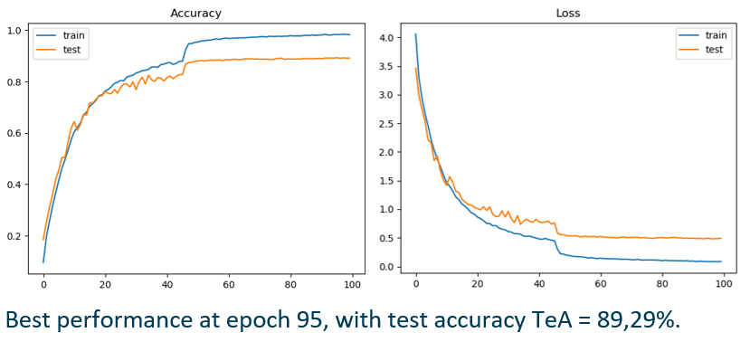

# AI-Projectwork
Project work of Cognitive Computing and Artificial Intelligence course of University of Catania.

## Table of Contents
- [References](#References)
- [Specifications](#Specifications)
- [Progress](#Progress)
- [Hardware](#Hardware)
- [External Projects](#External Projects)

## References
References available (italian only) at:
- doc/Presentazione.pptx

## Specifications
1. We have trained the CycleGAN model (https://github.com/junyanz/pytorch-CycleGAN-and-pix2pix) on the dataset of white and black people's face https://cloud.perceive.dieei.unict.it/index.php/s/6DAy4nKfwCs7ofi). CycleGAN generates two models: the first one transforms white faces in black faces, the second one does the opposite.
2. We have downloaded the UCF-101 dataset (https://www.crcv.ucf.edu/data/UCF101.php), a dataset of action recognition (input -> video, output -> class).
3. We have divided UCF-101 in Utrain, Uval, Utest.
4. We have trained a classifier on the faces, so that given an image of the black_white dataset it returns its class (black or white).
5. We have used a face detection model (chosen between https://www.learnopencv.com/face-detection-opencv-dlib-and-deep-learning-c-python/) and generated a new version of Utrain, in which, in every image, we have extracted the face, classified it (black or white) and converted it in the opposite colour throught the corresponding CycleGAN model. We have therefore generated the Utrain-inv dataset.
6. We have trained the 3D ResNets for Action Recognition video classifier (https://github.com/kenshohara/3D-ResNets-PyTorch) using a resnet-18 on Utrain and verified its performance on Utest.
7. We have trained the 3D ResNets for Action Recognition video classifier on Utrain-inv, and verified its performance on Utest.
8. We have trained the 3D ResNets for Action Recognition video classifier on the union of Utrain and Utrain-inv, and verified its performance on Utest.

## Progress
- **Video classifier on Utrain - Utest**

- **Video classifier on Utrain-inv - Utest**

- **Video classifier on Utrain + Utrain-inv - Utest**

## Hardware
- CPU: AMD Ryzen 5 2600x
- Graphic Card: Gygabyte GeForce RTX 2070 Windforce
- RAM: 32GB ddr4 3200MHz
- SSD: Crucial MX500 500GB

## External Projects
We have used the following external projects:
- CycleGAN: https://github.com/junyanz/pytorch-CycleGAN-and-pix2pix
- Face detection model: https://www.learnopencv.com/face-detection-opencv-dlib-and-deep-learning-c-python/
- VideoClassifier: https://github.com/kenshohara/3D-ResNets-PyTorch
